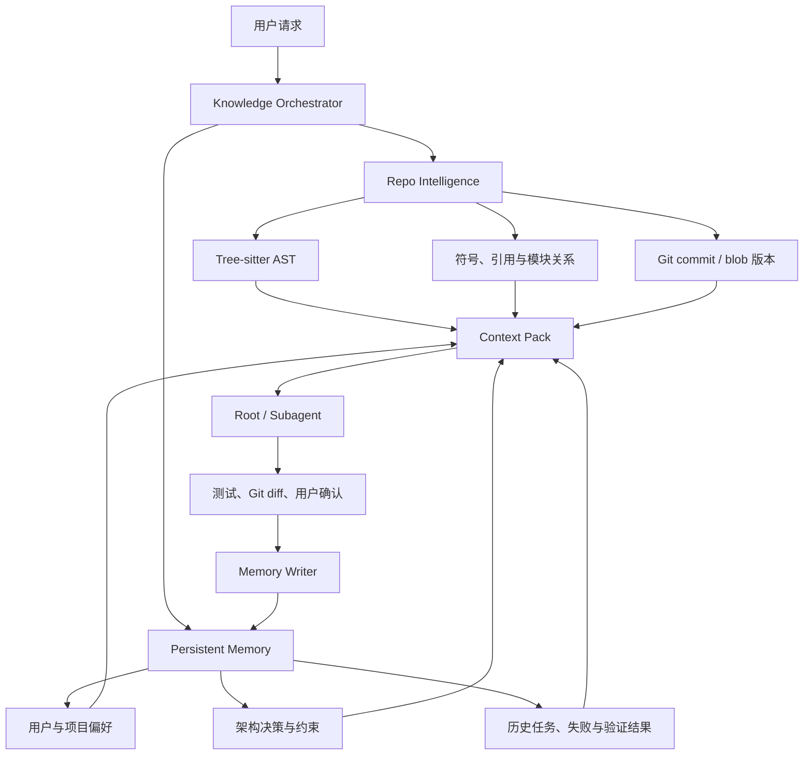

# 持久化项目记忆与 Repo 代码智能编排方案

> 项目定位：为 Kimi Code CLI 构建统一的项目知识层，让 Agent 同时理解「仓库现在是什么样」以及「过去为什么这样设计」。建议以持久化对话记忆和增量 Repo Intelligence 为两条能力线，由统一编排器完成检索、校验和上下文注入。

## 1. 项目目标与可行性

这两个方向适合形成同一条项目主线，而不是两个互不相关的功能：Repo Intelligence 提供当前代码事实，持久化记忆保存历史决策、用户偏好和经过验证的工程经验，编排器负责将二者合成为有来源、可失效且受 Token 预算约束的上下文。

```text
理解当前仓库 + 检索历史决策
        ↓
生成任务上下文
        ↓
Agent 执行并验证
        ↓
沉淀新的项目记忆
```

当前仓库已经具备 `Session` 持久化、Git 上下文、Hook、Wire、子 Agent 生命周期和文件搜索工具，可以作为接入基础。项目不需要重写 Agent 主循环，主要工作集中在知识存储、增量索引、召回编排和有效性校验，因此整体具有较高可行性。

## 2. 总体架构



三个核心模块的职责应保持清晰：

| 模块 | 负责内容 | 不应负责 |
| --- | --- | --- |
| Repo Intelligence | 文件、符号、定义、引用、模块依赖和 Git 版本 | 用户偏好、历史决策和失败经验 |
| Persistent Memory | 决策、约束、偏好、任务结论和验证结果 | 保存整份源码或替代 AST 索引 |
| Knowledge Orchestrator | 查询规划、并行召回、排序、冲突检测和 Token 预算 | 自行生成未经验证的代码事实 |

例如，`KimiSoul.run()` 的定义位置属于 Repo Intelligence；「团队决定不在主循环中直接写数据库」属于 Persistent Memory；当前代码是否违反该历史决策，则由编排器结合双方证据判断。

## 3. Repo Intelligence 设计

Repo Intelligence 负责构建可增量更新的仓库事实层。首期建议仅支持 Python，通过 Tree-sitter 提取文件、类、函数、方法和 import，并保存符号之间的定义、引用和模块依赖关系。

索引至少包含：

- 文件路径、语言、内容 hash 和最后索引时间；
- 符号名称、限定名、类型、源码范围和签名；
- import、定义、引用和可静态确定的调用关系；
- Git commit、blob hash 和工作区脏状态；
- 按文件或模块生成的短摘要。

文件变化时根据内容 hash 重新解析，删除文件时清理关联符号和引用。查询层首期提供 `search_symbol`、`find_references`、`module_summary` 和 `related_files` 即可，不必一开始覆盖多语言或完整静态分析。

现有 [`collect_git_context`](../../src/kimi_cli/subagents/git_context.py#L18) 只能提供远端、分支、脏文件和最近提交等元信息；新模块应在此基础上补充结构化代码事实，而不是替换 `Glob`、`Grep` 和 `ReadFile`。

## 4. Persistent Memory 设计

现有会话能够恢复原始 `context.jsonl`，但新会话不会自动检索历史知识。Persistent Memory 应作为项目级知识库，与原始会话历史分离。

建议支持以下记忆类型：

- `preference`：用户或团队的稳定偏好；
- `decision`：架构决策、采用原因和替代方案；
- `constraint`：仓库约束、兼容要求和安全边界；
- `lesson`：已验证的成功方案或失败经验。

每条记忆需要保存作用域、来源会话、创建时间、置信度、验证方式和关联代码引用。源码本身不应复制进长期记忆，记忆只保存结论、理由以及可回溯的文件和符号位置。

```python
class MemoryRecord(BaseModel):
    id: str
    project_id: str
    kind: Literal["preference", "decision", "constraint", "lesson"]
    content: str
    source_session_id: str
    confidence: float
    validation: str | None
    code_references: list[CodeReference]
    created_at: float
    status: Literal["valid", "possibly_stale", "stale", "conflicted"]
```

首期可以使用 SQLite 和 FTS5 完成持久化与关键词召回，不必立即引入向量数据库。向量检索应在基线评测证明关键词召回不足后再增加。

## 5. 两个模块的编排流程

### 5.1 查询规划与并行召回

编排器根据请求选择知识来源：代码定位任务以 Repo Intelligence 为主；历史决策和用户偏好以 Persistent Memory 为主；功能设计和代码修改同时检索两者。MVP 可以先用规则分类，避免额外的 LLM 调用。

```python
repo_results, memory_results = await asyncio.gather(
    repo_index.search(query, git_revision=current_revision),
    memory_store.search(query, project_id=project_id),
)
```

### 5.2 合并、去重与冲突检测

检索结果可能存在三种关系：互补、重复和冲突。编排器应合并重复约束，并使用 Repo Intelligence 检查记忆引用的文件和符号是否仍然存在。发现冲突时，不应静默选择一方，而应向 Agent 标记当前事实、历史结论及其可信状态。

```text
当前代码事实：
- BackgroundTaskManager 使用 asyncio.create_task 启动后台 Agent。

历史项目决策：
- 某次会话提出使用持久化 worker 队列。
- 该决策早于当前 HEAD，尚未确认仍然有效。

处理建议：
- 将历史决策作为候选背景，不作为强约束。
```

### 5.3 Context Pack 与 Token 预算

编排结果应作为当前轮次的动态 `Context Pack` 注入，不应永久追加到原始 `context.jsonl`，否则恢复会话时会重复加载已经过期的 Repo 信息。

可采用固定预算比例：代码事实占 50%，历史决策和约束占 30%，任务经验占 20%。每条内容都必须附带来源，使 Agent 能继续读取原始文件或会话，而不是一次性注入完整内容。

## 6. 记忆失效与写入控制

记忆过期是该项目最关键的生产问题。每条与代码有关的记忆应关联文件、符号、Git commit 和 blob hash：

```python
class CodeReference(BaseModel):
    path: str
    symbol: str | None
    git_commit: str
    blob_hash: str | None
```

检索记忆时检查文件和符号是否仍存在、blob 是否变化、相关测试是否仍通过，并将记忆标记为：

- `valid`：代码证据仍然成立；
- `possibly_stale`：文件发生变化，但符号仍然存在；
- `stale`：文件或符号已删除；
- `conflicted`：当前代码与历史结论相反。

记忆写入同样需要门槛。原始对话继续由现有 `Context` 保存；回合结束后只生成候选记忆，经过测试、Git diff 或用户确认后再升级为长期记忆。临时猜测、未验证结论、大段 Shell 输出、可从 AST 恢复的源码以及敏感信息均不应进入长期存储。

## 7. 在 Kimi Code CLI 中的接入点

建议沿用当前运行时边界：

- 在 [`Runtime.create`](../../src/kimi_cli/soul/agent.py#L212) 初始化项目级 `MemoryStore`、`RepoIndex` 和 `KnowledgeOrchestrator`；
- 在 `KimiSoul.run()` 或 `_turn()` 中，于 User 消息进入模型前构建动态 `Context Pack`；
- 保留 [`Context`](../../src/kimi_cli/soul/context.py#L20) 的原始会话持久化职责；
- 让 Root Agent 和子 Agent 共享项目知识层，但继续保持各自对话上下文；
- 使用 `TurnEnd`、`SubagentStop` 等 Hook 生成候选记忆；
- 通过 Wire 记录召回来源、失效状态、注入 Token 和检索延迟。

这样可以最大限度复用现有 `Session`、审批、Wire 和子 Agent 生命周期，避免建立旁路 Agent 或重复会话系统。

## 8. MVP 范围与实施顺序

建议按以下顺序推进：

1. 建立 SQLite Schema、项目标识和统一检索结果模型。
2. 实现 Python Tree-sitter 增量索引和符号查询。
3. 实现四类记忆、FTS5 召回及来源追踪。
4. 实现并行召回、去重、代码引用校验和 Token 预算。
5. 接入 Root Agent 与子 Agent 的动态上下文。
6. 接入候选记忆提取、验证和失效更新。
7. 增加 Wire 可观测信息及离线评测工具。

首期明确不做多语言全覆盖、复杂向量数据库、自动保存所有对话、云端知识服务或完整编译器级调用图。范围控制比功能数量更重要。

## 9. 评测与验收

项目应使用同一批真实仓库任务对比 baseline 和 candidate，至少衡量：

- 首次定位正确文件和符号的耗时；
- `Grep`、`ReadFile` 等探索工具调用次数；
- 输入 Token 和总任务成本；
- 历史约束召回准确率以及过期记忆误用率；
- 文件变化后的增量索引延迟；
- 最终任务成功率和测试通过率。

还应覆盖会话重启、Git 分支切换、文件重命名、符号删除、数据库损坏、并发索引和敏感信息过滤等测试。没有这些失败场景，功能只能证明 Demo 可运行，不能证明具备生产质量。

## 10. 项目质量结论

「持久化项目记忆 + 增量 Repo Intelligence」是一条完整且有辨识度的秋招项目主线。Repo Intelligence 为记忆提供版本校验，解决历史知识过期问题；持久化记忆为代码索引补充设计原因和工程经验，解决结构事实缺少语义的问题；编排器则把两者变成 Agent 可以安全消费的上下文。

如果项目只能演示保存聊天摘要和列出函数名称，质量仍属于普通 Demo。若能展示代码修改后记忆自动降级或失效、Agent 重复探索明显减少、Token 和定位耗时下降，并提供完整测试和可复现实验，则可以达到优秀秋招项目水平。
