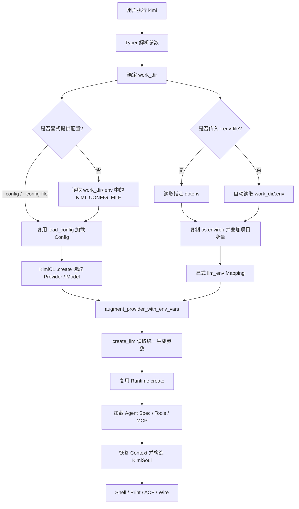

# Kimi CLI — 秋招项目简历（项目级多模型配置改造）

> **项目名称**：Kimi CLI：面向多项目、多模型场景的配置隔离与启动链路改造  
> **项目性质**：开源项目二次开发  
> **角色**：核心功能开发者  
> **时间**：2026.08  
> **关键词**：`Python` `Typer` `asyncio` `Pydantic` `python-dotenv` `Dependency Injection` `pytest` `LLM Provider`

---

## S — 背景 Situation

Kimi CLI 是一个运行在终端中的开源 Coding Agent，已具备 Shell、Print、ACP、Wire 等多种前端，会话恢复、工具调用、MCP、子 Agent、审批和事件流等完整运行时能力。原有模型配置主要来自全局配置文件 `~/.kimi/config.toml` 和进程环境变量，适合单一用户环境，但在同时维护多个项目、切换 Kimi 与 OpenAI-compatible 模型提供商时存在三个问题：

- 不同项目共用全局配置，切换模型、API 地址和密钥时需要反复修改配置或传递命令行参数；
- 直接 `export` 环境变量会污染整个终端进程及其子进程，项目之间容易串用模型或凭据；
- `llm.py` 直接读取 `os.environ`，配置来源与 LLM 构造耦合，难以注入独立环境并验证优先级和隔离行为。

因此，本次改造不重写已有 Agent 运行时，而是在现有 `CLI → Config → LLM → Runtime` 启动链路中增加一个项目级、可覆盖、无全局副作用的配置层。

---

## T — 任务 Task

在保持原有配置文件、环境变量和各类 UI 启动方式兼容的前提下，完成项目级 LLM 配置能力：

| 目标 | 约束 |
|------|------|
| 每个工作目录可通过 `.env` 选择配置文件并覆盖模型参数 | 不修改 `os.environ`，不影响其他项目和后续模块 |
| 支持 `--env-file` 显式指定 dotenv 文件 | 未传参数时仍兼容原有启动方式，并自动发现项目 `.env` |
| 让 Kimi 与 OpenAI-compatible Provider 共用同一注入机制 | 复用原有 `Config`、`LLMProvider`、`LLMModel` 和 `create_llm()` |
| 明确配置优先级与相对路径语义 | 无效配置路径应在启动早期给出可诊断错误 |
| 补齐测试、命令帮助和用户文档 | 不把上游已有 Agent、Session、MCP、Wire 能力描述为个人实现 |

---

## A — 行动 Action

### Phase 1：基于 Git 历史还原启动架构，确定最小改造面

- 结合模块提交历史，从 `src/kimi_cli/__main__.py` 追踪 Typer 主回调、Session 创建、`KimiCLI.create()` 装配、`llm.py` Provider 构造、Runtime 初始化和 UI 分发，确认配置改造的接入点应位于 **工作目录确定之后、LLM 创建之前**。
- 将原有能力按职责拆分：CLI 层负责参数和路径解析，`config.py` 负责 TOML/JSON 模型，`llm.py` 负责 Provider 适配，`app.py` 负责把 Config、LLM、Runtime、Agent、Context 和 KimiSoul 接线。
- 没有另建一套配置框架，而是保留现有 Config 与 Provider 抽象，仅把“配置从哪里读取”从“如何创建 LLM”中解耦，控制改动范围并保持旧调用方兼容。

### Phase 2：设计双层配置模型与确定性优先级

- 将项目配置拆成两个互补层次：
  - **结构化配置层**：继续使用已有 TOML/JSON，保存 Provider 类型、模型别名、上下文长度和 thinking 能力等稳定结构；
  - **项目环境层**：新增 `.env`，保存 API Key、Base URL、实际模型名和生成参数等项目私有覆盖项。
- 为配置文件选择建立优先级：`--config` → `--config-file` → 工作目录 `.env` 中的 `KIMI_CONFIG_FILE` → 原有默认配置；其中相对 `KIMI_CONFIG_FILE` 路径统一按工作目录解析，不存在时在 CLI 启动阶段直接报错。
- 为 LLM 环境覆盖建立优先级：`--env-file` 指定文件优先于工作目录 `.env`；选定文件中的值覆盖当前进程环境，再覆盖已加载的 Provider/Model 配置。

### Phase 3：实现无副作用的 dotenv 读取与显式依赖注入

- 新增 `utils/dotenv.py`：
  - `load_dotenv_values()` 使用 `python-dotenv` 解析文件，但不调用 `load_dotenv()`，避免直接写入全局进程环境；
  - `load_llm_env()` 先复制 `os.environ`，再在副本上叠加项目 `.env`，形成只读 `Mapping[str, str]` 供当前 Kimi CLI 实例使用。
- 将 `augment_provider_with_env_vars()` 和 `create_llm()` 从内部硬编码 `os.getenv()` 改为接收可选 `Mapping`；未传入时仍回退到 `os.environ`，从而兼容原有调用方，同时让项目环境可以被单元测试和其他前端显式注入。
- 复用原有 Provider 分支和参数校验逻辑，将同一份环境映射贯穿 Provider/Model 覆盖及 `temperature`、`top_p`、`max_tokens`、`thinking_keep` 等生成参数解析，避免配置在不同阶段读取到不一致的值。

### Phase 4：接入 CLI 与应用装配链路

- 在 Typer 主命令新增 `--env-file` 参数，利用 Typer/Click 自带的存在性、文件类型和可读性校验，避免重复实现路径验证。
- 将 `work_dir` 的解析前移，使 CLI 能在加载 Config 前定位项目 `.env`；从中解析 `KIMI_CONFIG_FILE`，并处理 `~` 展开、相对路径拼接和文件存在性校验。
- 在 `KimiCLI.create()` 中复用 `Session.work_dir` 自动发现默认 `.env`，构造当前实例专属的 `llm_env`，依次传入 Provider 覆盖和 `create_llm()`；之后继续沿用原有 OAuth、Runtime、Agent Spec、Context 恢复、KimiSoul、Hooks、Telemetry 和 UI 流程。
- 增加 `dev/deepseek.toml` 作为 OpenAI-compatible Provider 示例，将 Provider/模型结构保留在 TOML，将密钥和端点覆盖留在项目 `.env`，验证该方案不依赖单一模型厂商。

### Phase 5：测试、文档与回归验证

- 新增 3 个针对性单元测试，覆盖 dotenv 解析不修改进程环境、项目值覆盖进程值、LLM 层使用显式环境映射而非偷读全局变量。
- 在中文环境变量文档和命令参考中补充 `.env`、`KIMI_CONFIG_FILE`、`--env-file` 的使用方式与优先级，并在 CLI `--help` 中暴露新参数。
- 对 `dotenv.py`、`llm.py`、`app.py`、CLI 与相关测试执行 Ruff 检查；运行 dotenv 与 LLM 构造相关测试集，结果为 **34 passed**。

---

## 复用了什么，新增了什么

| 层次 | 复用的上游能力 | 本次新增或修改 |
|------|----------------|----------------|
| CLI | Typer 主回调、`--config` / `--config-file`、参数校验、UI 模式分发 | `--env-file`；工作目录 `.env` 发现；`KIMI_CONFIG_FILE` 路径解析与错误处理 |
| 配置 | `Config`、`load_config()`、TOML/JSON、Provider/Model 数据模型 | 项目环境覆盖层；结构配置与敏感覆盖项分离；明确优先级 |
| LLM | Kimi、OpenAI Legacy/Responses Provider 分支；Kosong LLM 抽象；OAuth | 将全局 `os.getenv()` 重构为可注入 `Mapping`，统一 Provider 与生成参数的配置来源 |
| 运行时 | `Session.work_dir`、`KimiCLI.create()`、Runtime、Agent、Context、KimiSoul | 在 LLM 构造前注入实例级 `llm_env`，后续运行时保持不变 |
| 工程化 | pytest、Ruff、现有中文文档结构 | dotenv 工具模块、3 个新增测试、DeepSeek 示例配置、用户文档与 CLI Help |

> 核心取舍：复用成熟的 Agent 执行框架，只新增“项目配置解析与注入”这一薄层；通过显式环境映射代替全局状态，使改造可以独立测试，也不会把项目密钥传播到不相关模块。

---

## 修改后的整体框架流程



新的主流程可以概括为：

```text
CLI 参数 + 项目工作目录
    → 选择结构化 Config
    → 选择项目 dotenv
    → 构造不污染进程的 llm_env
    → 覆盖 Provider / Model / 生成参数
    → 创建 LLM
    → 复用原有 Runtime → Agent → Context → KimiSoul → UI
```

---

## R — 成果 Result

- 将原有“全局配置 + 全局环境变量”扩展为“全局默认 + 项目配置 + 显式 env 文件”的多层配置体系，使不同仓库可独立选择模型、API 地址和生成参数，无需反复修改用户级配置。
- 通过复制并注入 `Mapping` 的方式隔离项目环境；测试验证 `.env` 可以覆盖当前进程中的同名值，但不会反向修改 `os.environ`。
- 保持旧 API 兼容：`augment_provider_with_env_vars()` 与 `create_llm()` 未接收显式环境时仍使用原有进程环境，原有 Provider 与 UI 调用链无需重写。
- 完成代码、示例配置、CLI Help 和中文文档闭环；相关测试集 **34 项全部通过**，目标文件 Ruff 检查通过。

> **结果边界**：当前证据能够支撑“完成项目级配置改造并通过相关回归测试”；尚无线上用户量、启动耗时或故障率数据，因此简历中不写未经实验验证的性能提升比例。

---

## 可直接投递的简历版本

### 项目名称

**Kimi CLI：面向多项目、多模型场景的配置隔离与启动链路改造**｜开源项目二次开发｜2026.08

### 技术栈

`Python`、`Typer`、`Pydantic`、`python-dotenv`、`Kosong`、`pytest`、`Ruff`

### 项目描述

Kimi CLI 是支持会话恢复、工具调用、MCP、子 Agent 及 Shell/ACP 等多前端的终端 Coding Agent。本项目针对多仓库共用全局模型配置、环境变量易串用的问题，在不重写现有 Agent Runtime 的前提下，为启动链路增加项目级、无全局副作用的 LLM 配置层。

### 个人工作

- 基于 Git 历史和源码调用链，梳理 `CLI → Config → LLM → Runtime → Agent → KimiSoul → UI` 架构，定位配置接入点并复用现有 Typer、Config、Session、Provider 与 Runtime 抽象，避免侵入核心 Agent 循环。
- 新增项目 `.env` 自动发现和 `--env-file` 参数，支持通过 `KIMI_CONFIG_FILE` 选择项目 TOML/JSON；实现显式配置、项目配置与全局默认的优先级、相对路径解析及启动期错误校验。
- 将 LLM 层对 `os.getenv()` 的隐式依赖重构为可注入的 `Mapping[str, str]`，以“复制进程环境 + 叠加项目值”实现实例级配置隔离，并统一驱动 Provider、模型及生成参数构造，兼容 Kimi 与 OpenAI-compatible 接口。
- 补充 DeepSeek Provider 示例、CLI/中文文档和 3 个隔离性测试；dotenv 与 LLM 相关回归测试 **34 项通过**，目标模块 Ruff 检查通过。

---

## 面试核心表达

> 我没有重做 Kimi CLI 已有的配置和 Agent 框架，而是先通过 Git 历史和调用链确定边界：Typer 负责参数，Config 负责结构，llm.py 负责 Provider，app.py 负责装配。真正的问题是 LLM 构造直接读取全局环境，所以我增加项目 dotenv 层，并把环境从全局状态改成显式依赖。现在每次启动先根据工作目录选择 Config 和 dotenv，再生成当前实例独享的环境映射，覆盖 Provider、模型和生成参数，之后继续走原有 Runtime、Agent、Context、KimiSoul 与 UI 流程。这样既实现了多项目隔离，也保持了旧调用方兼容。

---

## 高频追问速答

**Q：为什么不直接调用 `load_dotenv()`？**

`load_dotenv()` 会修改 `os.environ`，使项目配置变成进程级全局状态，后续创建的 Provider、插件或子进程都可能读到不属于自己的值。我选择解析后生成环境副本，并显式传给 LLM 构造链路，副作用边界更清晰，也更容易测试。

**Q：为什么同时保留 TOML 和 `.env`？**

两者职责不同：TOML 适合保存 Provider 类型、模型别名、能力集等可版本化结构；`.env` 适合保存密钥、私有端点和项目覆盖。让 `.env` 通过 `KIMI_CONFIG_FILE` 选择 TOML，可以在不复制整份结构配置的情况下实现项目级切换。

**Q：这次改造复用了哪些关键模块？**

复用了 Typer 参数系统、`Config/load_config`、`Session.work_dir`、Pydantic Provider/Model、Kosong Provider 适配、OAuth、`KimiCLI.create()` 以及后续 Runtime/Agent/KimiSoul/Wire 链路。本次新增集中在配置发现、环境合并和显式注入，没有把上游已有功能包装成个人产出。

**Q：如何保证兼容性？**

新增的 `env` 参数都是可选参数；调用方不传时仍回退到 `os.environ`。没有项目 `.env` 时也继续使用原配置文件和进程环境，因此旧命令和各 UI 模式保持原行为。

**Q：当前测试还缺什么？**

现有测试已覆盖 dotenv 的无副作用读取和 LLM 显式注入；后续应补充 CLI 集成测试，完整覆盖 `--config`、`--config-file`、`KIMI_CONFIG_FILE`、`--env-file` 的优先级，以及配置文件不存在、相对路径和 Shell/Print/ACP 多入口的一致性。

---

## 关键代码位置

| 模块 | 路径 | 作用 |
|------|------|------|
| CLI 参数与配置选择 | `src/kimi_cli/cli/__init__.py` | `--env-file`、work_dir、`KIMI_CONFIG_FILE` 和优先级 |
| 应用装配 | `src/kimi_cli/app.py` | 自动发现 `.env`，生成 `llm_env` 并注入 LLM 链路 |
| dotenv 工具 | `src/kimi_cli/utils/dotenv.py` | 无副作用解析与环境副本合并 |
| LLM 适配 | `src/kimi_cli/llm.py` | Provider/Model 覆盖及生成参数显式注入 |
| 示例配置 | `dev/deepseek.toml` | OpenAI-compatible Provider 与模型定义 |
| 单元测试 | `tests/utils/test_dotenv.py`、`tests/core/test_create_llm.py` | 环境隔离、覆盖语义和兼容性验证 |

---

## 真实性检查清单

- [x] 将 Session、Runtime、Agent、MCP、子 Agent、Wire 等标为上游复用能力
- [x] 将个人实现范围限定为项目级配置发现、隔离、注入、测试与文档
- [x] 测试结果来自本地实际执行：34 passed；Ruff 检查通过
- [x] 未虚构性能提升、线上使用量、PR 合并或生产部署结果
- [ ] 投递前补充 CLI 配置优先级集成测试，可进一步增强结果证据
