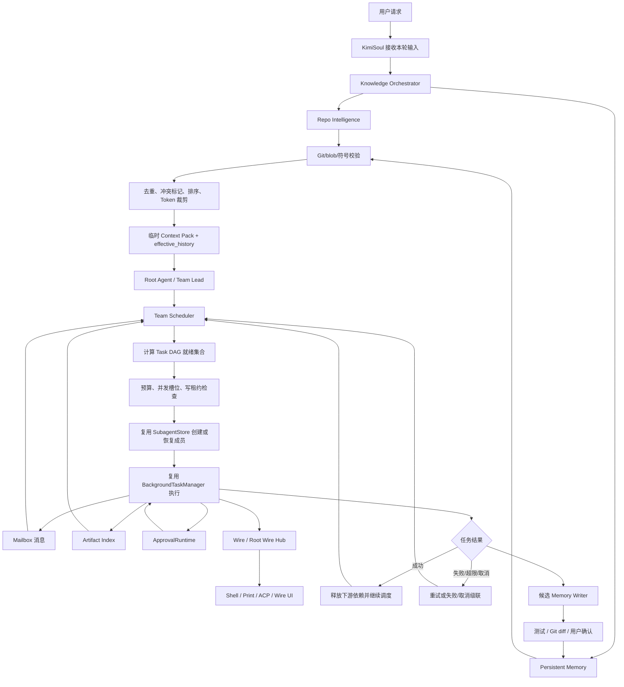

# Kimi Code CLI — 秋招项目简历（Action 丰富版）

> **项目名称**：Kimi Code CLI：具备持久化项目知识与多 Agent Teams 编排能力的开源 Coding Agent  
> **角色**：核心开发者  
> **时间**：2025.06 — 至今  
> **关键词**：`Python` `asyncio` `SQLite/FTS5` `Tree-sitter` `Pydantic` `Typer` `Git` `pytest` `Multi-Agent` `Event-Driven`

> **真实性说明**：当前仓库已经具备 Agent 主循环、单会话持久化、子 Agent、后台任务、审批和 Wire 事件系统；Repo Intelligence、Persistent Memory 和完整 Agent Teams 仍属于新增项目范围。未完成相应代码、测试和评测前，应将下文中的“实现”改为“设计”，不要把规划写成已经上线的能力。

---

## S — 背景 Situation

Kimi Code CLI 是一个运行在终端中的开源 Coding Agent，已具备异步主循环、会话恢复、子 Agent、后台任务、审批和事件驱动 UI。但在大型仓库的长期开发中，现有架构仍有两个瓶颈：

- **知识断层**：`Session` 和 `Context` 能恢复指定会话，`SubagentStore` 也能保存子 Agent 的独立上下文，但新会话不会主动检索其他会话中的架构决策、工程约束和验证经验；Agent 仍需通过 `Glob`、`Grep`、`ReadFile` 重复探索仓库。
- **协作缺失**：Root Agent 可以并发启动多个后台子 Agent，`BackgroundTaskManager` 也能管理任务状态、输出、超时和终止，但现有 `TaskSpec` 没有依赖边、成员消息、共享工件和统一预算，多个 Agent 本质上仍是彼此独立的后台任务。

> **代码规模背景**：运行时 Python 约 6.6 万行，测试约 6.4 万行（来自仓库调研快照，仅用于说明系统复杂度，不作为个人产出）。

---

## T — 任务 Task

在不重写 Agent 主循环、不另建旁路执行系统的前提下，基于现有 Runtime 和 Session 基础设施完成两项改造：

| 知识平面 | 协作平面 |
| --- | --- |
| 构建统一项目知识层，增量索引当前代码事实，持久化跨会话工程记忆，并在每次模型推理前注入经过来源追踪、时效校验和 Token 裁剪的 Context Pack | 在现有子 Agent 和后台任务之上增加 Agent Teams 编排层，以确定性状态机管理 Team、Member、Task DAG、Mailbox、Artifact、预算、取消和恢复 |

同时满足以下工程约束：

- 当前代码事实与历史决策分开存储，避免用不可验证的记忆替代源码；
- 动态 Repo 快照不永久写入原始会话历史，避免恢复会话时重复注入过期内容；
- LLM 只负责语义拆解和总结，任务就绪、状态迁移、预算扣减和失败传播由代码状态机保证；
- 首期限制团队规模并采用单写者策略，避免开放无限递归和多写者后造成资源失控或文件冲突；
- 所有“提升”必须通过固定仓库、任务、模型和预算的 baseline/candidate 实验验证。

---

## A — 行动 Action

### Phase 1：从源码调用链划分边界，确定最小侵入式接入点

- 沿 `CLI → KimiCLI.create() → Runtime.create() → Agent → Context → KimiSoul.run() → Toolset → Wire/UI` 还原完整启动和执行链路，并继续追踪子 Agent 创建、后台任务、审批投影与会话落盘过程，明确系统中“执行”“持久化”“协作”“展示”的责任边界。
- 核对现有能力后，将可复用基础拆为五层：
  - `Session`、`Context` 和 `SubagentStore` 已能保存会话、消息历史、子 Agent 元数据、独立 `context.jsonl` 与 `wire.jsonl`；
  - `Runtime.copy_for_subagent()` 已能让子 Agent 共享配置、审批、通知和 Root Wire Hub，同时保持独立上下文；
  - `BackgroundTaskManager` 已能异步启动 Agent、限制并发、记录运行状态、输出、心跳、超时和终止信号；
  - `ApprovalRuntime` 已能按执行来源创建、等待、解析和取消审批，并把请求投影到 Root Wire；
  - `Wire` 已提供 Soul 到 UI 的单生产者多消费者事件通道和 JSONL 回放能力。
- 识别出两个关键缺口：现有持久化边界是“单个 Session”，不能提供项目级跨会话检索；现有后台任务是“独立 Task 列表”，不能表达任务依赖和成员协作。
- 基于上述边界把改造拆成两个正交平面：知识平面只负责“给 Agent 什么可信上下文”，协作平面只负责“哪些 Agent 在什么条件下执行什么任务”，两者继续调用同一套 Agent Runtime，不复制 LLM、工具、审批或 UI 框架。

### Phase 2：实现 Repo Intelligence 增量代码事实层

- 新增项目级 `RepoIndex`，首期仅解析 Python：通过 Tree-sitter 提取文件、类、函数、方法、签名、源码范围、import、定义、引用和可静态确定的模块依赖，形成可查询的符号图，而不是保存整份源码副本。
- 复用现有工作目录和 Git 上下文作为项目作用域，通过当前 `HEAD`、文件 blob hash、工作区脏状态和内容 hash 判断变化范围：
  1. 启动或后台刷新时读取当前 revision 与文件清单；
  2. 将文件 hash 与索引快照对比，只解析新增或变化文件；
  3. 在单个事务中删除旧符号/引用并写入新结果；
  4. 对已删除文件级联清理关联记录；
  5. 保存本轮 revision 和索引时间，供查询与失效判断使用。
- 在 SQLite 中建立 `files`、`symbols`、`references`、`imports` 和 `index_snapshots` 等事实表，并提供 `search_symbol`、`find_references`、`module_summary`、`related_files` 等最小查询接口；继续保留 `Glob`、`Grep`、`ReadFile` 作为最终源码核验手段。
- 将 Tree-sitter 限定为结构提取器，不把静态分析结果包装成绝对正确的调用图；无法静态解析的动态调用只返回候选关系，并附带文件、行号、commit 和 blob 来源。

### Phase 3：实现 Persistent Memory 与 Git-aware 失效机制

- 在同一个项目级 SQLite 数据库中新增记忆表，但与 RepoIndex 事实表保持逻辑隔离；使用 Pydantic 定义 `MemoryRecord` 和 `CodeReference`，将记忆限定为四类：
  - `decision`：架构决策、采用原因和替代方案；
  - `constraint`：兼容性、安全和工程约束；
  - `preference`：用户或团队的稳定编码偏好；
  - `lesson`：经过验证的成功方案和失败经验。
- 复用 Session ID、Turn/Hook 事件和 Git diff 作为来源信息。每轮结束只生成“候选记忆”，只有通过测试结果、代码 diff 或用户确认后才升级为长期记忆；过滤临时猜测、大段工具输出、可由 AST 恢复的源码和疑似敏感信息。
- 使用 SQLite FTS5 为记忆正文、标签、符号名和路径建立关键词索引，先以可离线、可解释、易调试的召回方式建立基线；只有评测证明语义召回不足时再增加 embedding，避免首期引入额外服务和双索引一致性问题。
- 为每条代码相关记忆绑定 `source_session_id`、`git_commit`、`blob_hash`、文件路径、符号限定名、验证方式和置信度；召回时与当前 RepoIndex 交叉校验：
  - 文件、blob 与符号均未变化，标为 `valid`；
  - 文件发生变化但符号仍存在，标为 `possibly_stale`；
  - 文件或符号已经删除，标为 `stale`；
  - 当前代码事实与历史结论相反，标为 `conflicted`。
- 不静默丢弃过期或冲突记忆，而是降低排序权重并把“历史结论—当前证据—状态”一起交给 Agent，使其能回到源码继续核验。

### Phase 4：实现 Knowledge Orchestrator 与临时 Context Pack

- 新增 `KnowledgeOrchestrator` 作为 RepoIndex 与 MemoryStore 的唯一查询入口，根据请求类型选择数据源：代码定位以 RepoIndex 为主，偏好或历史决策以 MemoryStore 为主，设计和修改任务同时查询两者。
- 使用 `asyncio.gather()` 并行召回代码事实与历史记忆，再执行统一的结果管线：
  1. 按路径、符号和规范化文本去重；
  2. 使用当前 Git/blob/符号信息校验记忆时效；
  3. 对当前事实与历史决策进行冲突标记；
  4. 综合相关性、来源可信度、时效状态和任务类型排序；
  5. 按 Token 预算裁剪并生成带来源引用的 Context Pack。
- 复用 `KimiSoul` 已有的动态注入扩展点和 `effective_history` 组装逻辑，但调整注入语义：Context Pack 只加入本次 LLM 请求使用的历史副本，不调用 `Context.append_message()` 写入原始 `context.jsonl`。原始 Context 仍只保存用户、Assistant 和 Tool 的真实交互，避免恢复或压缩后重复加载旧 Repo 快照。
- 为 Context Pack 设置分区预算，例如当前代码事实占 50%、架构决策与约束占 30%、历史验证经验占 20%；单条结果只注入摘要和来源位置，Agent 需要细节时继续调用文件工具读取原文。
- 通过 Wire 新增知识查询开始/结束、来源数量、失效状态、注入 Token 和检索耗时事件，使 Shell、Print、ACP 等前端可以选择展示或忽略，而无需改变核心查询逻辑。

### Phase 5：在现有子 Agent 之上增加 Agent Teams 确定性编排层

- 新增 `Team`、`Member`、`TeamTask` 和 `Dependency` 领域模型：Team 记录目标与总预算，Member 绑定既有 `agent_id` 和角色，TeamTask 记录输入、依赖、负责人、尝试次数、预算、状态、结果与失败原因。
- 将任务状态机限定为显式迁移，例如 `pending → ready → running → completed/failed/cancelled/blocked`；创建或更新 DAG 时执行环检测，只有全部前置任务成功且预算、并发槽位、写租约均满足时，Scheduler 才能把任务从 `pending` 推进到 `ready`。
- 复用 `SubagentStore` 创建和恢复成员实例，复用 `BackgroundTaskManager.create_agent_task()` 执行已就绪任务，复用既有超时、心跳、输出、kill 和完成通知；Team Scheduler 不重新实现 Agent Runner，只负责把 DAG 中的逻辑任务映射到已有后台 Agent Task，并记录二者 ID 的对应关系。
- 复用 `ApprovalRuntime` 的来源模型，将审批绑定到具体 `team_id`、`team_task_id` 和 `agent_id`；当任务取消、成员退出或 Team 终止时，沿用按来源取消待处理审批的机制，防止孤儿审批继续阻塞运行时。
- 复用 Root Wire Hub 汇总子 Agent 事件，新增 Team/Task/Member 状态变化事件；前端只消费事件，不参与调度决策，从而保持 Shell、Print、ACP、Wire 多入口行为一致。

### Phase 6：补齐 Mailbox、Artifact、预算和写冲突控制

- 新增持久化 Mailbox，为每条消息记录发送者、接收者、关联任务、消息类型、正文、创建时间和消费状态；成员完成探索或发现阻塞时写入结构化消息，Scheduler 通过事件唤醒目标成员或 Root，而不是把所有协作信息都回灌到 Root Agent 的上下文。
- 新增 Artifact Index，只记录工件类型、生产者、关联任务、文件路径或内容 hash、摘要和验证状态；代码、测试报告和设计文档仍保存在工作区或现有输出文件中，索引层不重复存储大块内容。
- 建立分层预算控制：Team 保存总 Token/时间/重试预算，Task 获得子预算，Member 每次执行实时回报消耗；创建任务和重试前做预算预留，完成后结算，超限时停止派发新任务并触发取消传播。
- 实现失败与取消传播规则：前置任务失败后，下游强依赖任务转为 `blocked`；成员超时或丢失时先回收租约，再根据重试策略重新排队或标记失败；用户取消 Team 时，由 Scheduler 终止运行任务、取消关联审批并阻止新的 Task 进入 `ready`。
- MVP 采用单写者租约：`explore` 和 `reviewer` 可并行只读，只有一个 `coder` 能获得工作区写租约；租约包含 owner、过期时间和心跳，成员异常退出后可回收。后续再扩展为独立 git worktree 并行修改与集成任务合并。

### Phase 7：实现持久化恢复、测试矩阵与效果评测

- 将 Team、Task DAG、Mailbox、Artifact、预算账本和租约写入 Session 目录下的独立状态存储；所有状态更新采用 SQLite 事务或项目已有的原子写模式，避免进程中断后出现半写状态。
- 会话恢复时执行 `load → reconcile → schedule`：读取持久化 Team 状态，对照 `SubagentStore`、后台 Task 心跳和终态修正 `running` 任务；回收失效租约；把不可恢复任务标为 `lost` 或重新排队；最后重新计算 DAG 就绪集合，而不是盲目重跑全部任务。
- 为知识平面覆盖首次索引、单文件修改、文件删除、分支切换、脏工作区、符号重命名、FTS5 召回、过期记忆、冲突记忆、数据库损坏与并发刷新。
- 为协作平面覆盖 DAG 环检测、依赖就绪、并发上限、成员异常退出、依赖失败、预算耗尽、审批取消、重复通知、租约回收、并发写冲突和重启恢复。
- 建设固定仓库、固定任务、固定模型、固定预算和固定重复次数的 baseline/candidate 脚本，采集首次定位正确文件耗时、`Grep`/`ReadFile` 调用数、输入 Token、成功率、过期记忆误用率、Team 关键路径耗时、重复工作率和冲突率；保留原始 Trace 和失败样本，不用预期值代替实测结果。

---

## 复用了什么，新增了什么

| 层次 | 复用的现有能力 | 本项目新增内容 |
| --- | --- | --- |
| 应用装配 | `KimiCLI.create()`、`Runtime.create()`、工作目录和配置 | 项目级 `RepoIndex`、`MemoryStore`、`KnowledgeOrchestrator`、`TeamScheduler` 的生命周期装配 |
| 会话与上下文 | `Session`、`Context`、`context.jsonl`、`SessionState` | 跨会话项目知识库；请求级 Context Pack；Team/DAG/Mailbox/Artifact 持久化 |
| 代码理解 | `Glob`、`Grep`、`ReadFile`、现有 Git 上下文 | Tree-sitter 符号/引用/依赖索引；按 commit、blob 和内容 hash 增量更新 |
| 子 Agent | `LaborMarket`、`AgentTool`、`SubagentStore`、前后台 Runner、恢复能力 | Team/Member 领域模型；Task 到 Agent 实例的绑定；成员协作协议 |
| 后台执行 | `BackgroundTaskManager`、Task 状态、输出、心跳、超时、kill、通知 | DAG 就绪调度、重试、依赖失败传播、分层预算和崩溃恢复协调 |
| 安全审批 | `ApprovalRuntime`、来源绑定、Root Wire 投影、按来源取消 | 审批来源扩展到 team/task/member；Team 取消时级联清理 |
| 可观测性 | `Wire`、Root Wire Hub、JSONL 记录、Shell/Print/ACP 消费端 | Knowledge 与 Team 事件、召回来源、预算、关键路径和恢复 Trace |
| 数据与一致性 | Pydantic 模型、原子 JSON 写入模式 | SQLite/FTS5 Schema、事务化索引刷新、记忆失效状态、写租约 |

> **核心取舍**：复用成熟的 Agent 执行、审批和 UI 管道，只新增知识与编排控制面；代码事实、历史记忆、任务状态分别由确定性数据结构维护，LLM 不作为唯一数据库或状态机。

---

## 改造后的整体框架流程



新的端到端流程可以概括为：

```text
用户请求
  → 并行召回当前代码事实与历史工程记忆
  → 用 Git/blob/符号校验时效，完成去重、冲突标记和 Token 裁剪
  → 将 Context Pack 临时加入本次模型请求
  → Root Agent 生成或更新任务 DAG
  → Scheduler 根据依赖、预算、并发槽位和写租约派发任务
  → 复用现有子 Agent、后台任务、审批与 Wire 完成执行
  → 通过 Mailbox 传递结构化结果，通过 Artifact Index 共享工件引用
  → 成功时释放下游依赖；失败时重试、阻塞或级联取消
  → 经测试、Git diff 或用户确认后沉淀新的项目记忆
  → 会话重启时从持久化状态 reconcile 后继续调度
```

---

## R — 成果 Result

### 可在闭环完成后陈述的工程结果

- 将原有“单会话历史 + 临时文件搜索”扩展为项目级知识平面，使当前代码结构与跨会话工程决策能够统一召回，同时保留来源、版本和失效状态。
- 将原有“Root Agent 并发启动独立子 Agent”扩展为可持久化的协作编排平面，使复杂目标能够通过 Task DAG、Mailbox、Artifact、预算和写租约受控执行。
- 通过复用 Runtime、Subagent、Background、Approval 和 Wire，避免维护第二套 Agent 生命周期与 UI 协议，将新增复杂度集中在知识一致性和协作状态机。
- 建立覆盖分支切换、代码删除、记忆过期、Agent 异常退出、依赖失败、预算耗尽和并发写冲突的测试矩阵，并形成可复现的 baseline/candidate 评测流程。

### 必须用实测填写的效果指标

| 指标 | Baseline | Candidate | 说明 |
| --- | ---: | ---: | --- |
| 首次定位正确文件耗时 | `[待测]` | `[待测]` | RepoIndex 是否减少盲目探索 |
| `Grep` / `ReadFile` 调用数 | `[待测]` | `[待测]` | 符号索引是否减少重复读取 |
| 输入 Token 消耗 | `[待测]` | `[待测]` | Context Pack 是否降低总上下文成本 |
| 最终任务成功率 | `[待测]` | `[待测]` | 成本优化不能牺牲正确率 |
| 过期记忆误用率 | `[待测]` | `[待测]` | Git-aware 失效机制是否有效 |
| Team 关键路径耗时 | `[待测]` | `[待测]` | 并行调度是否真正缩短交付时间 |
| 重复工作率 | `[待测]` | `[待测]` | Mailbox 与任务分配是否有效 |
| 并发写冲突率 | `[待测]` | `[待测]` | 单写者租约是否可靠 |

> 在得到固定任务集的真实结果前，简历中只写“实现闭环并建立评测”，不写未经验证的百分比。

---

## 可直接投递的简历版本

### 项目描述

Kimi Code CLI 是支持会话恢复、工具调用、MCP、子 Agent、后台任务和多前端的开源终端 Coding Agent。本项目针对大型仓库中新会话重复探索、历史决策无法复用以及多个子 Agent 缺少任务依赖和协作状态的问题，在不重写现有 Agent Runtime 的前提下，增加项目级知识平面与 Agent Teams 编排平面。

### 个人工作

- 梳理 `CLI → Runtime → KimiSoul → Context/Toolset → Wire/UI` 及子 Agent、后台任务、审批调用链，复用现有 Session、SubagentStore、BackgroundTaskManager、ApprovalRuntime 与 Wire，确定在 Runtime 生命周期和模型请求前后增加知识与编排控制面。
- 使用 Tree-sitter 与 SQLite/FTS5 构建 Python 文件、符号、引用和模块依赖的增量索引，以 Git commit、blob hash 和符号存在性校验架构决策、工程约束、编码偏好和验证经验，支持 `valid`、`possibly_stale`、`stale`、`conflicted` 四级记忆状态。
- 实现 Knowledge Orchestrator，并行召回代码事实与跨会话记忆，完成去重、冲突标记、来源追踪和 Token 预算裁剪；将 Context Pack 仅注入本次 `effective_history`，避免过期 Repo 快照污染原始会话历史。
- 在现有子 Agent 与后台任务之上增加 Team/Member/Task DAG 状态机、Mailbox、Artifact Index、分层预算、取消传播和单写者租约，支持依赖就绪调度、成员异常恢复及审批来源追踪。
- 建设覆盖分支切换、符号删除、过期记忆、DAG 环、依赖失败、预算耗尽、Agent 异常退出和并发写冲突的测试矩阵，并以固定任务集对比定位耗时、探索调用、Token、成功率和 Team 关键路径耗时。

> 如果目前只完成设计，应把上述动词统一改为“设计”，并删除尚无代码和测试支撑的实现细节；如果只完成知识层或 Teams 中的一条闭环，则只保留对应的两至三条个人工作。

---

## 面试核心表达

> 我没有重写 Kimi Code CLI 的 Agent 执行框架，而是先从源码划清边界：Session 解决单会话恢复，Subagent 和 Background 解决独立任务执行，Approval 与 Wire 解决安全交互和可观测性；缺少的是项目级知识和确定性协作状态机。因此我在 Runtime 中装配 RepoIndex、MemoryStore、KnowledgeOrchestrator 和 TeamScheduler。每轮先并行召回代码事实与历史记忆，用 Git/blob/符号做时效校验，再把受 Token 预算约束的 Context Pack 临时送入模型；Root Agent 生成 DAG 后，Scheduler 根据依赖、预算和写租约复用现有后台 Agent 执行，并通过 Mailbox、Artifact 和 Wire 收敛结果。这样新增的是知识与编排控制面，原有 LLM、工具、审批、会话和 UI 管道都继续复用。

---

## 关键代码与拟接入位置

| 模块 | 现有路径 | 在新架构中的作用 |
| --- | --- | --- |
| 应用装配 | `src/kimi_cli/app.py` | 创建 Session、Runtime、Agent、Context 和 KimiSoul；装配新增项目级依赖 |
| Runtime | `src/kimi_cli/soul/agent.py` | 持有共享知识服务和 Team Scheduler；复制子 Agent Runtime |
| 主循环 | `src/kimi_cli/soul/kimisoul.py` | 在 LLM 请求前组装临时 Context Pack，在回合后触发候选记忆 |
| 动态注入 | `src/kimi_cli/soul/dynamic_injection.py` | 复用 Provider 扩展方式，但将知识内容保持为请求级注入 |
| 会话持久化 | `src/kimi_cli/session.py`、`src/kimi_cli/soul/context.py` | 保持原始交互历史与 Session 状态职责不变 |
| 子 Agent 持久化 | `src/kimi_cli/subagents/store.py` | 创建、恢复和追踪 Team Member 对应的 Agent 实例 |
| 子 Agent 执行 | `src/kimi_cli/tools/agent/`、`src/kimi_cli/subagents/runner.py` | 执行 Scheduler 已派发的成员任务 |
| 后台任务 | `src/kimi_cli/background/` | 复用异步执行、状态、心跳、输出、超时、终止和通知 |
| 审批 | `src/kimi_cli/approval_runtime/` | 将高风险操作追踪到 Team、Task 和 Agent，并支持级联取消 |
| 事件与 UI | `src/kimi_cli/wire/`、`src/kimi_cli/ui/` | 记录和展示知识召回、Team 状态、预算与恢复事件 |
| Repo Intelligence | `拟新增：src/kimi_cli/knowledge/repo_index/` | Tree-sitter 增量索引、符号查询和 Git-aware 版本管理 |
| Persistent Memory | `拟新增：src/kimi_cli/knowledge/memory/` | SQLite/FTS5 记忆、来源、验证和失效状态 |
| Knowledge Orchestrator | `拟新增：src/kimi_cli/knowledge/orchestrator.py` | 查询规划、并行召回、冲突处理与 Context Pack |
| Agent Teams | `拟新增：src/kimi_cli/teams/` | Team/DAG、Mailbox、Artifact、预算、租约与恢复状态机 |

---

## 真实性检查清单

- [ ] “实现”“优化”“提升”等动词均有代码、测试、提交或 PR 支撑
- [ ] Repo Intelligence、Persistent Memory、Knowledge Orchestrator 和 Agent Teams 的完成状态与仓库一致
- [ ] Runtime、Session、Subagent、Background、Approval、Wire 明确写为复用的上游能力
- [ ] Context Pack 的实际实现不会永久写入 `context.jsonl`
- [ ] 百分比来自固定任务集的重复实验，并保留原始 Trace 与失败样本
- [ ] 能指出每条简历 bullet 对应的源码、测试和提交
- [ ] 能解释至少一个失效记忆、任务恢复或写冲突失败案例
- [ ] 没有把应用层审批描述为 OS 级沙箱
- [ ] 没有把现有独立后台 Agent 描述成已经具备完整 Teams 编排
- [ ] 没有把整个开源仓库的代码量、测试量或 Star 数当作个人贡献
